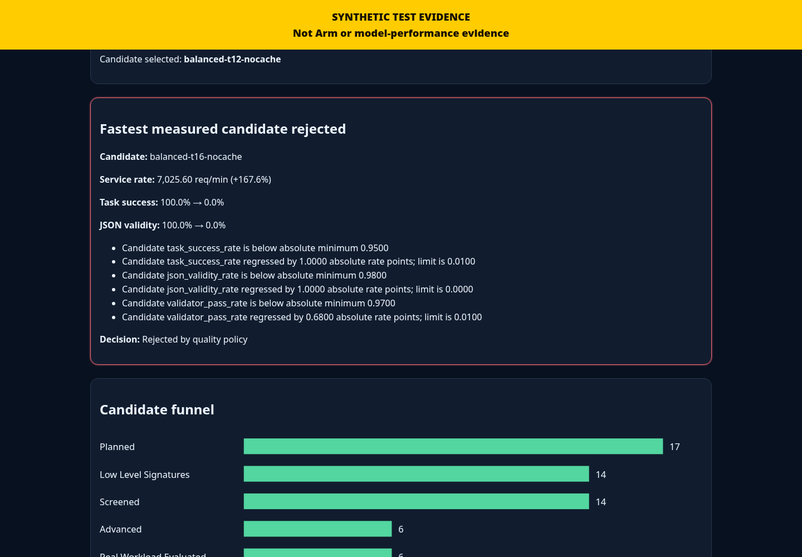
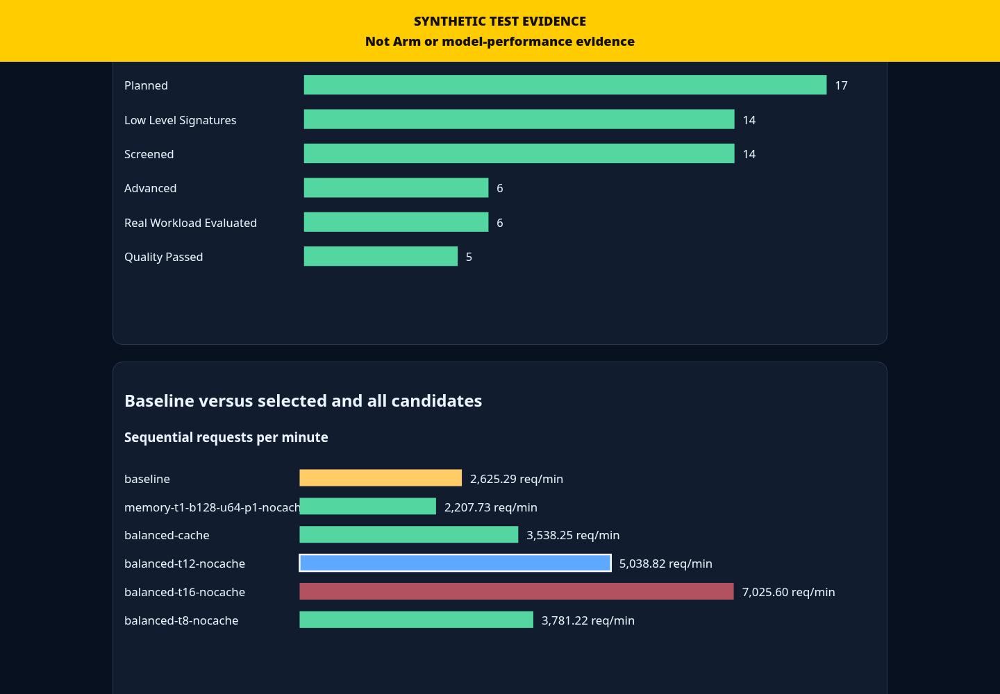
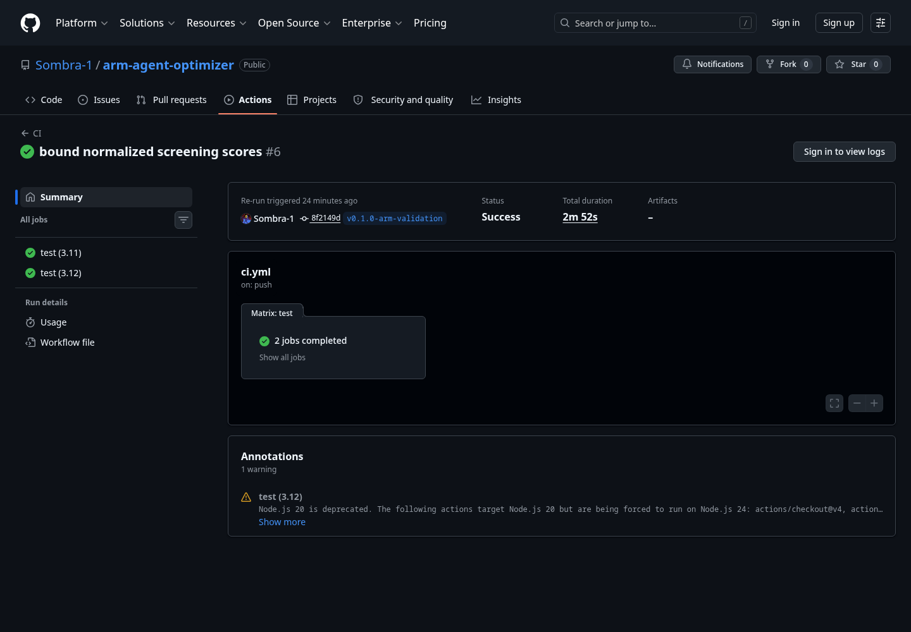

# AArchTune

**AArchTune automatically finds a fast, reliable `llama.cpp` configuration for a real AI workload on an Arm64 machine.**

**Challenge track: Cloud AI**

AArchTune targets Arm-powered cloud and server platforms by optimizing CPU inference configurations for `llama.cpp` workloads on Linux AArch64.

AArchTune is a local-first, quality-constrained inference autotuner. Give it a readable GGUF model, a representative JSONL workload, `llama-server`, and `llama-bench`; it measures one reproducible baseline, plans a bounded hardware-aware search, screens low-level signatures, evaluates advanced profiles through the real workload, rejects correctness regressions, and produces an auditable deployment bundle.

> Results are specific to the recorded hardware, model, workload, runtime binaries, generation settings, and quality policy. Synthetic fixtures are tests—not Arm performance evidence.

## The problem

`llama.cpp` exposes useful CPU controls, but the fastest low-level setting may return malformed JSON, choose forbidden actions, time out, consume excessive memory, or regress application correctness. Tokens per second alone cannot answer whether a configuration is safe for a real application.

## The key insight: fastest is not always best

AArchTune separates low-level screening from real-workload evidence. Only completed, comparable profiles that pass absolute and fresh-baseline-relative quality gates enter final ranking. A faster candidate can be rejected while a slower reliable profile is selected.

## How it works

```text
doctor → baseline → bounded plan → llama-bench screen
       → real-workload evaluation → quality gate → selection
       → Passport + report + deployment bundle
```

No model is trained or modified. AArchTune optimizes runtime configuration only.

## Quick start

Requirements: Linux, Python 3.11+, local CPU inference, readable GGUF model, and compatible `llama-server`/`llama-bench` executables.

```bash
python -m venv .venv
.venv/bin/pip install -e '.[dev]'
.venv/bin/aarchtune doctor
```

## One-command optimization

```bash
aarchtune optimize \
  --server-binary /opt/llama.cpp/build/bin/llama-server \
  --bench-binary /opt/llama.cpp/build/bin/llama-bench \
  --model /models/model.gguf \
  --workload workloads/reliability-agent.jsonl \
  --goal balanced \
  --output-dir results/my-optimization
```

Resume with the identical options plus `--resume`. Completed stages are reused only after native integrity validation and provenance checks.

## Individual stage commands

```bash
aarchtune doctor
aarchtune baseline --binary LLAMA_SERVER --model MODEL --workload WORKLOAD --output-dir results/baseline
aarchtune plan --baseline results/baseline --goal balanced --output-dir results/plan
aarchtune screen --plan results/plan --bench-binary LLAMA_BENCH --output-dir results/screening
aarchtune evaluate --screening results/screening --output-dir results/evaluation
aarchtune finalize --evaluation results/evaluation --output-dir results/final
aarchtune passport verify results/final/optimization-passport.json
```

## Workloads

Each non-empty JSONL line defines messages, deterministic generation settings, and declarative validators. V1 supports valid JSON, JSON Schema, required fields, exact/allowed values, text inclusion/exclusion, regex, maximum response length, and request success. See [workload format](docs/workload-format.md).

## Quality policy

Quality gates combine absolute floors, permitted percentage-point regression from the fresh baseline, timeout limits, evidence completeness, repetition requirements, and critical-validator regression. See [quality policy](docs/quality-policy.md).

## Arm64 and KleidiAI

`aarchtune doctor` detects AArch64, ASIMD, DotProd, I8MM, SVE, SME, cores, memory, NUMA, runtime flags, and conservative KleidiAI evidence. KleidiAI is never marked verified merely because the machine is Arm64. See [Arm optimization](docs/arm-optimization.md) and [real Arm runbook](docs/real-arm-validation-runbook.md).

For users without physical Arm hardware, see the [native GitHub Actions Arm64 validation workflow](docs/github-actions-arm64-validation.md).

## Generated outputs

The final bundle contains a self-contained report, Optimization Passport, Pareto frontier, selected configuration, capability-proven command, safe local run script, reproduction script, checksums, and either a Compose artifact or an explicit unavailable-status file.

## Optimization Passport

The Passport binds the selection to hardware, binaries, model, workload, policies, stage evidence, rejection reasons, drift, unavailable metrics, and reproduction instructions. Its canonical content hash and referenced artifacts are verified with `aarchtune passport verify`. See [Passport documentation](docs/optimization-passport.md).

## Report

`report.html` is self-contained: embedded CSS, inline accessible SVG, no CDNs, no external fonts, no network requests, and no raw model responses. It highlights selection, the fastest quality-rejected profile when applicable, candidate funnel, comparisons, Pareto evidence, drift, provenance, and limitations. See [final report](docs/final-report.md).

## Submission preview

The screenshots below demonstrate the product workflow. Performance screenshots currently use clearly labelled synthetic fixtures and are not Arm64 benchmark evidence.

### Quality-constrained selection



### Candidate funnel and evidence



### Public validation



## Reproducibility

Every stage records exact hashes and typed configuration. Warm-ups are excluded from measured statistics. Candidate order is deterministic. An ending baseline sentinel detects substantial temporal drift. See [benchmark methodology](docs/benchmark-methodology.md).

## Security and privacy

AArchTune uses argument lists, loopback binding, owned-process cleanup, bounded files/timeouts, declarative validators, and redaction. It never executes model output, uploads evidence, downloads models automatically, or requires root. Raw evaluation responses may contain sensitive workload data and remain outside the compact final bundle. See [security](docs/security.md).

## Limitations

Sequential service rate is not concurrent throughput. Client TTFT is unavailable in non-streaming v1. Sampled memory is interval-dependent. Page cache, thermals, and background work can affect measurements. Workload validators cover only what their author specifies. A selected profile is not universally optimal. See [limitations](docs/limitations.md).

## Development and testing

```bash
python -m pip install -e '.[dev]'
pytest
ruff check .
ruff format --check .
mypy src
scripts/validate-release.sh
```

Tests run on x86 with clearly labelled synthetic fixtures and never require model downloads. CI does not validate real Arm performance.

## Hackathon context

AArchTune is an original open-source hackathon project focused on Arm-aware, quality-preserving GGUF inference tuning. Submission guidance and evidence mapping live in [Devpost draft](docs/devpost-submission.md) and [judging map](docs/judging-map.md). Real performance placeholders must be replaced only after following the Arm64 runbook.

## Challenge-period development

AArchTune was created and substantially implemented during the Arm AI Optimization Challenge period. The initial validated public MVP was published on July 22, 2026, and the repository history records the implementation, testing, release validation, and publication fixes completed during the challenge.

## License

MIT. See [LICENSE](LICENSE).
