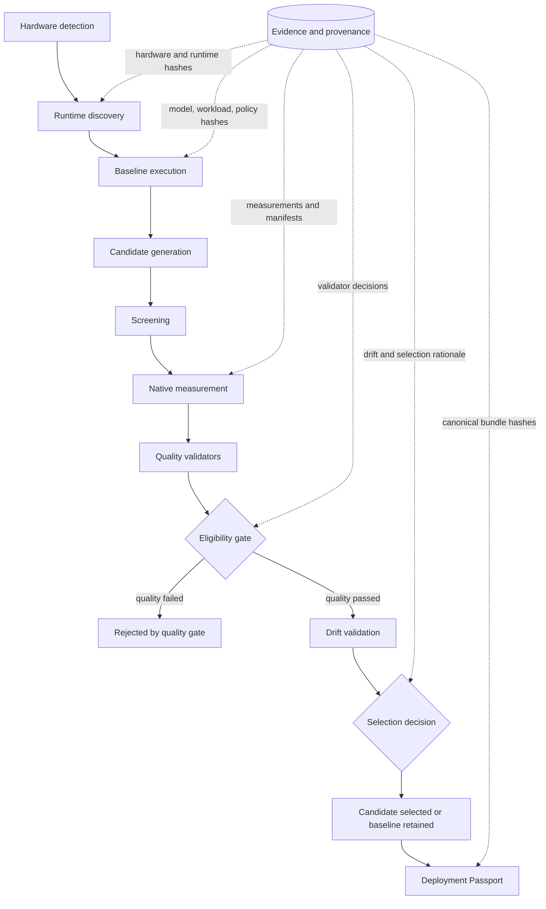

# AArchTune

**Arm Create 2026 · Cloud AI Track**

[](https://github.com/Sombra-1/arm-agent-optimizer/actions/workflows/ci.yml)

**Quality-gated GGUF optimization for native Arm64.**

Arm64-native · GGUF/llama.cpp · workload-aware quality gates · reproducible
evidence · safe candidate selection

AArchTune searches CPU inference configurations, measures real workload
behavior, verifies evidence and provenance, and recommends a result only when
performance and correctness both pass.

> **Strongest validated result:** AArchTune completed a real 132-execution
> native Arm64 optimization workflow and correctly retained no candidate
> because none satisfied the unchanged quality policy.

That `no_eligible_candidate` outcome is the product working as designed—not a
performance win and not a crashed optimization.

## The problem

`llama.cpp` exposes useful controls for threads, batching, parallel slots,
memory mapping, prompt caching, and context. A speed-only optimizer can select a
configuration that produces malformed JSON, wrong actions, timeouts, or
semantic regressions.

AArchTune asks a stricter question:

> Which configuration is faster, correct, reproducible, and safe to deploy?

It refuses to convert faster-but-wrong measurements into a recommendation.

## What AArchTune does

- Detects Arm64 hardware, topology, memory, CPU capabilities, and runtime flags.
- Measures a fixed real-workload baseline.
- Generates a deterministic, bounded, hardware-aware candidate plan.
- Deduplicates low-level benchmark signatures before expensive evaluation.
- Runs advanced candidates through isolated `llama-server` processes.
- Applies declarative task validators and absolute/baseline-relative quality gates.
- Validates start/end baseline drift.
- Selects an eligible candidate or explicitly retains/rejects the baseline.
- Produces a verifiable Optimization Passport, report, and deployment bundle.

No model is trained or modified. AArchTune tunes runtime configuration only.

## Why Arm64

Arm cloud and server CPUs differ in core topology, memory headroom, NUMA
layout, and instruction support. AArchTune uses recorded hardware evidence
rather than assuming that more threads, larger batches, mmap changes, or
parallel requests are always beneficial.

Real optimization requires Linux AArch64. Synthetic and non-Arm modes require
explicit development opt-ins and cannot produce Arm performance claims.

KleidiAI was compiled into the pinned llama.cpp build. During the
Qwen2.5-1.5B Q4_K_M native smoke, llama.cpp reported that q4_K tensors had no
KleidiAI kernel and were not accelerated; the available kernels were reported
for Q4_0 and Q8_0. No end-to-end KleidiAI runtime speedup is claimed for this
tested model. Build integration was verified, tested Q4_K runtime acceleration
was not present, and no general claim is made about other tensor formats or
hardware.

## Architecture


```mermaid
flowchart TD
    H[Hardware detection] --> R[Runtime discovery]
    R --> B[Baseline execution]
    B --> C[Candidate generation]
    C --> S[Screening]
    S --> N[Native measurement]
    N --> V[Quality validators]
    V --> G{Eligibility gate}
    G -- quality failed --> X[Rejected by quality gate]
    G -- quality passed --> D[Drift validation]
    D --> Q{Selection decision}
    Q --> O[Candidate selected or baseline retained]
    O --> P[Deployment Passport]

    E[(Evidence and provenance)]
    E -. hardware and runtime hashes .-> R
    E -. model, workload, policy hashes .-> B
    E -. measurements and manifests .-> N
    E -. validator decisions .-> G
    E -. drift and selection rationale .-> Q
    E -. canonical bundle hashes .-> P
```

The `optimize` orchestrator calls the same validated stage APIs exposed by the
CLI. Stage artifacts remain separate, and downstream hashes bind each decision
to its inputs.

## Optimization lifecycle

```text
doctor → baseline → plan → screen → evaluate → quality gate
       → drift validation → select or retain → finalize → Passport
```

The final decision can legitimately be:

- an eligible candidate was selected;
- the baseline was retained because improvement was insufficient;
- no candidate was eligible because quality failed; or
- evidence was invalidated or incomplete.

## Quality-gating model

The quality gate runs before ranking. The default policy requires:

| Check | Default threshold |
| --- | ---: |
| Request success | at least 0.98 |
| Task success | at least 0.95 |
| JSON validity | at least 0.98 |
| Validator pass rate | at least 0.97 |
| Timeout rate | at most 0.02 |
| Completed evidence | at least 0.98 |
| Repetitions per task | at least 2 |

It also limits regression from a fresh baseline, protects critical validators,
and rejects evidence when drift exceeds policy. A quality failure excludes a
profile from ranking without deleting its diagnostic evidence.

See [quality policy](docs/quality-policy.md) and
[evaluation methodology](docs/evaluation-methodology.md).

## Native Arm64 validation

Validation used GitHub-hosted `ubuntu-24.04-arm`, native AArch64, four Arm
Neoverse-N2 cores, CPU inference, `n_gpu_layers=0`, and pinned llama.cpp
`b10106` at commit
`1425386fd996511e1f3295e7366c38289a92a271`.

### Full native optimization smoke

[Run 30119492016](https://github.com/Sombra-1/arm-agent-optimizer/actions/runs/30119492016)
completed the real pipeline:

| Evidence | Result |
| --- | ---: |
| Configured candidate executions | 132 |
| Completed candidate executions | 132 |
| Distinct candidate signatures | 11 |
| Advanced/evaluated candidates | 4 |
| Optimization outcome | `no_eligible_candidate` |
| Native optimize exit | 4 |

All candidates failed the unchanged quality policy. AArchTune therefore
published no speedup or deployment recommendation.

### Permanent native evidence

The reviewed Actions artifact had temporary retention, so its original ZIP
bytes are preserved in the repository with the original SHA-256:

- [evidence record and verification instructions](docs/evidence/README.md);
- [original artifact ZIP](docs/evidence/aarchtune-real-arm64-smoke-30119492016-1.zip);
  and
- [SHA-256 checksum](docs/evidence/aarchtune-real-arm64-smoke-30119492016-1.sha256).

Verify the checksum before trusting or extracting the ZIP. Preservation keeps
the existing sanitized evidence available; it does not create a new benchmark
claim or repeatability proof.

### Baseline-only model quality evidence

| Model and contract | Request | Task | JSON | Validators | Policy |
| --- | ---: | ---: | ---: | ---: | --- |
| Qwen2.5-1.5B Q4_K_M, prompt-only | 1.00 | 0.00 | 0.30 | 0.48 | failed |
| Qwen2.5-7B Q3_K_M, prompt-only | 1.00 | 0.40 | 0.80 | 0.72 | failed |
| Qwen2.5-14B Q3_K_M, prompt-only | 1.00 | 0.40 | 0.80 | 0.72 | failed |
| Qwen2.5-7B Q3_K_M, JSON-object | 1.00 | 0.40 | 0.80 | 0.72 | failed |
| Mistral Nemo 12B Q4_K_M, prompt-only | unavailable | unavailable | unavailable | unavailable | incomplete |

Scaling tested Qwen from 7B to 14B did not change the aggregate workload
result. Plain JSON-object mode also produced the same aggregate result as
prompt-only Qwen 7B. These observations are specific to the pinned models,
workload, settings, and runner; they are not universal model rankings.

Mistral was immutably pinned and verified, but both final CPU probe attempts
lost the hosted runner before baseline inference. Its quality, Arm
compatibility, RAM fit, and relative performance remain unknown.

See the [final validation report](docs/FINAL_VALIDATION_REPORT.md).

## Reproducible local demo

This short path validates the product without downloading a model or claiming
native performance:

```bash
python -m venv .venv
source .venv/bin/activate
python -m pip install -e '.[dev]'

aarchtune doctor --json
aarchtune workload validate workloads/smoke-test.jsonl --json
scripts/validate-release.sh
```

`doctor` describes the machine on which it runs; do not present x86 output as
Arm evidence. The demo should use the existing native report and sanitized
artifact for native claims. See the [three-to-five-minute demo
script](docs/DEMO_SCRIPT.md).

## Evidence and privacy

Every stage records typed configuration, exact hashes, manifests, completion
state, and provenance. Warm-ups are excluded from measured statistics.
Candidate order is deterministic, and an ending baseline sentinel checks drift.

Raw responses and server logs remain outside the compact final bundle. The
reviewed native workflow excludes model weights, caches, process streams,
request bodies, environment dumps, credentials, and private paths, then scans
the artifact before upload. The Passport references validated stage hashes
instead of copying sensitive evidence.

See [security](docs/security.md), [runtime safety](docs/runtime-safety.md), and
[Optimization Passport](docs/optimization-passport.md).

## Current limitations

- Native results come from an ephemeral shared runner, not a dedicated benchmark host.
- The completed native optimization is one smoke run, not repeatability proof.
- Tested Qwen models did not satisfy the workload quality policy.
- Mistral quality could not be measured because the hosted runner was lost.
- KleidiAI build integration is proven; the tested Q4_K tensors had no
  KleidiAI kernel, and no end-to-end runtime speedup is claimed.
- No candidate is claimed as production-optimal.
- Sequential service rate is not concurrent-client throughput.
- Broader Arm hardware and workload validation remains future work.

These boundaries are evidence discipline: unavailable or incomplete results are
not converted into zeroes, failures, or performance claims.

## Repository structure

| Path | Purpose |
| --- | --- |
| `src/aarchtune/` | Product implementation and CLI |
| `workloads/` | Deterministic workload definitions |
| `configs/` | Search, screening, and quality policies |
| `scripts/` | Release validation and Arm build helpers |
| `tests/` | Unit, integration, artifact, privacy, and workflow tests |
| `docs/` | Methodology, evidence, demo, and submission material |
| `.github/workflows/` | Normal CI and manual native evidence workflows |

## Installation

Requirements: Python 3.11+, Linux CPU inference, a readable GGUF model, and
compatible `llama-server`/`llama-bench` binaries for real optimization.

```bash
python -m venv .venv
source .venv/bin/activate
python -m pip install --upgrade pip
python -m pip install -e '.[dev]'
aarchtune --version
```

## CLI examples

Inspect the current host:

```bash
aarchtune doctor --json
```

Validate the workload:

```bash
aarchtune workload validate workloads/smoke-test.jsonl --json
```

Run the full pipeline on an authorized local model:

```bash
aarchtune optimize \
  --server-binary LLAMA_SERVER \
  --bench-binary LLAMA_BENCH \
  --model MODEL_GGUF \
  --workload workloads/reliability-agent.jsonl \
  --goal balanced \
  --output-dir results/optimization
```

Validate generated evidence:

```bash
aarchtune optimize validate results/optimization --json
aarchtune finalize validate results/optimization/final --json
aarchtune passport verify \
  results/optimization/final/optimization-passport.json --json
```

See [workload format](docs/workload-format.md),
[baseline methodology](docs/baseline-methodology.md), and
[search planning](docs/search-planning.md).

## Tests

```bash
source .venv/bin/activate
scripts/validate-release.sh
pytest
ruff check .
ruff format --check .
mypy src
```

The release suite contains 514 automated tests with 90% aggregate coverage.
Normal CI validates Python 3.11 and 3.12. Synthetic fixtures are explicitly
labelled and are product-behavior evidence, never native performance evidence.

## Submission status

Experimental work is frozen. No full-performance recommendation or unsupported
speedup claim is published. The remaining work is video recording, final link
verification, and Devpost submission.

- [Final validation report](docs/FINAL_VALIDATION_REPORT.md)
- [Devpost submission text](docs/devpost-submission.md)
- [Demo script](docs/DEMO_SCRIPT.md)
- [Video recording checklist](docs/VIDEO_RECORDING_CHECKLIST.md)
- [Submission checklist](docs/SUBMISSION_CHECKLIST.md)

## License

MIT. See [LICENSE](LICENSE).
