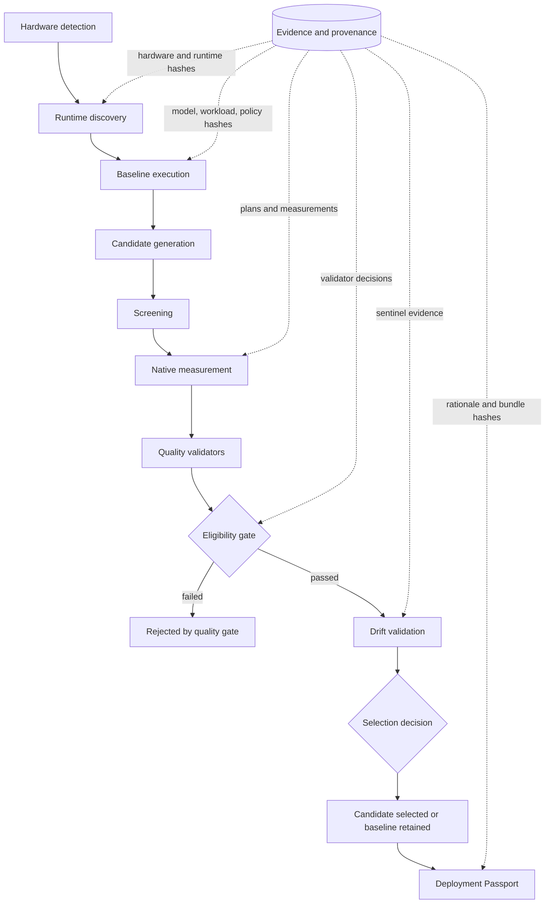

# Architecture

AArchTune is a staged evidence pipeline. The `optimize` command orchestrates the
same validated APIs exposed as individual CLI stages; it does not duplicate
benchmark, workload, quality, or selection logic.

## Stage boundaries

1. `doctor` records hardware, CPU capabilities, topology, memory, and runtime
   support.
2. `baseline` runs one fixed `llama-server` configuration against the declared
   workload.
3. `plan` creates a deterministic bounded candidate set without executing a
   server or benchmark.
4. `screen` deduplicates low-level signatures and performs bounded
   `llama-bench` measurements.
5. `evaluate` runs advanced candidates through isolated server processes and
   declarative workload validators.
6. The quality gate removes incomplete or incorrect candidates before ranking.
7. Start/end baseline sentinels validate drift.
8. `finalize` records selection, baseline retention, rejection, or invalidation
   and creates the Passport, report, and conditional deployment files.

## Evidence and privacy

Stage directories remain separate. Hashes bind downstream evidence to upstream
inputs, and resume trusts completed stages only after native validation. Raw
responses remain in private evaluation directories; the compact final bundle
references stage manifests and hashes instead of copying responses, server logs,
or environment dumps.

Related: [runtime safety](runtime-safety.md),
[search planning](search-planning.md),
[screening](screening-methodology.md),
[evaluation](evaluation-methodology.md), and
[Optimization Passport](optimization-passport.md).
